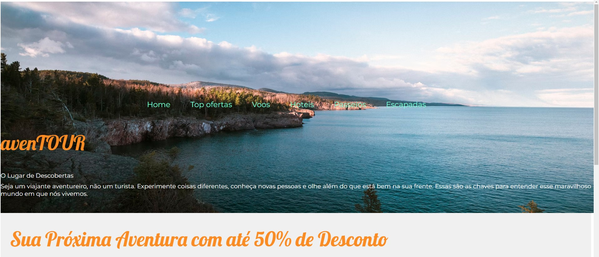
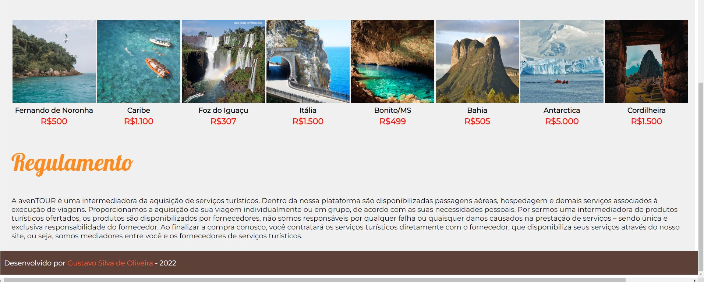

<h1 align="center"> Site de Viagens </h1>

Meu primeiro site desenvolvido na materia "Padroes de Projeto"  

  

  

## 🚀 Tecnologias

Esse projeto foi desenvolvido com as seguintes tecnologias:

- HTML e CSS
- Git e Github

## 💻 Projeto

Primeiro site desenvolvido na faculdade usando HTML E CSS.

- [visite o projeto online] (https://gsilvaol.github.io/site-de-viagens/)
